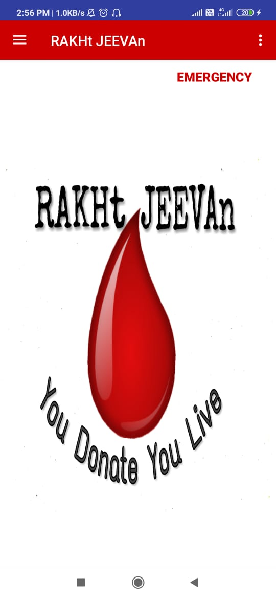
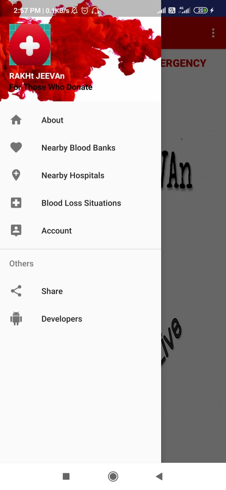
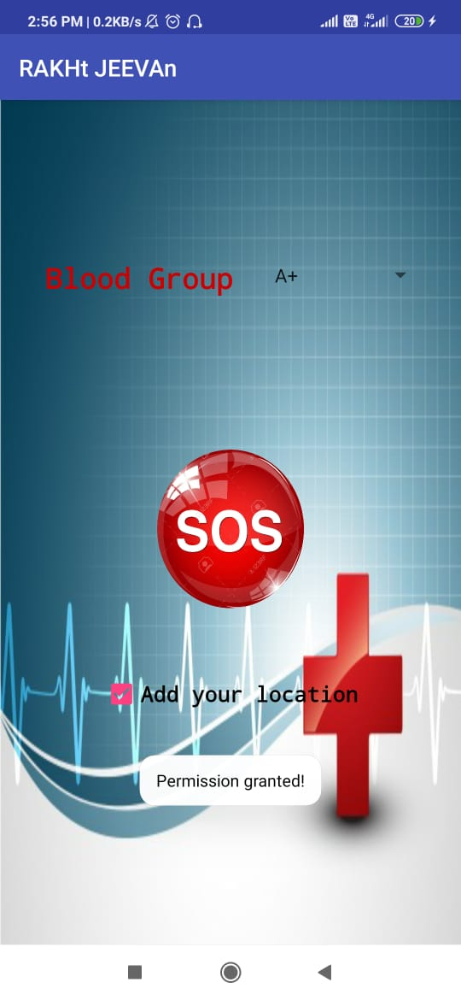

# Rakht-Jeevan

Rakht-Jeevan is an Android Application focused to help you in emergencies.

<><>

<><>

 

\

## Idea
Human body has 4.7-5.5 litres of blood in circulation. We know the importance of this fixed amount of blood in the body and also that a drop in it's amount can be fatal. Thousands of people lose their life in accidents or due to diseases when they are not provided with blood for life support in the required time.

Humans are too sensitive to pain and need. Nobody wants anyone(not only their loved ones) suffer or die due to unavailability of blood or blood components. An Easy interactive Android application to provide you with an easy and convenient availability of the required blood and blood components during all extreme situations.

## Features

A SOS button to request for sending out and emergency alert for help to your listed contacts and nearby people.
Information regarding nearby blood donation camps, hospitals and blood banks.

## Installation

Download [Android Studio](https://developer.android.com/studio) and use Get from Version Control using [project link](https://github.com/shashwat1998/Rakht-Jeevan).
Build Gradle and you are good to go.

## Contributing
Developed for the second edition of 36 hour hackathon, Hackfest at IIT(ISM) Dhanbad by Team Errors.

Pull requests are welcome. For major changes, please open an issue first to discuss what you would like to change.

